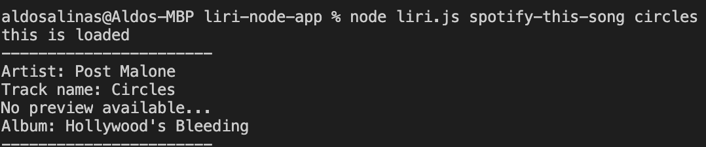

# liri-node-app

# The instructions are as follows:

#### node liri.js concert-this <artist/band name here> - This will return:
1. Name of the venue
2. Venue location
3. Date of the Event

#### node liri.js spotify-this-song '<song name here>' - This will return:

1. Artist(s)
2. Song Name
3. preview link of the son
4. The album
5. If no song is provided the default is "The Sign" by Ace of Base.

#### node liri.js movie-this '<movie name here>' - This will return:

1. Title.
2. Year of release.
3. IMDB Rating.
4. Rotten Tomatoes Rating.
5. Country where the movie was produced.
6. Language of the movie.
7. Plot of the movie.
8. Actors in the movie.
9. If a movie isn't provided, a default movie, 'Mr. Nobody', will be used.

#### node liri.js do-what-it-says

LIRI will take the text inside of random.txt and then use it to call one of LIRI's commands.

